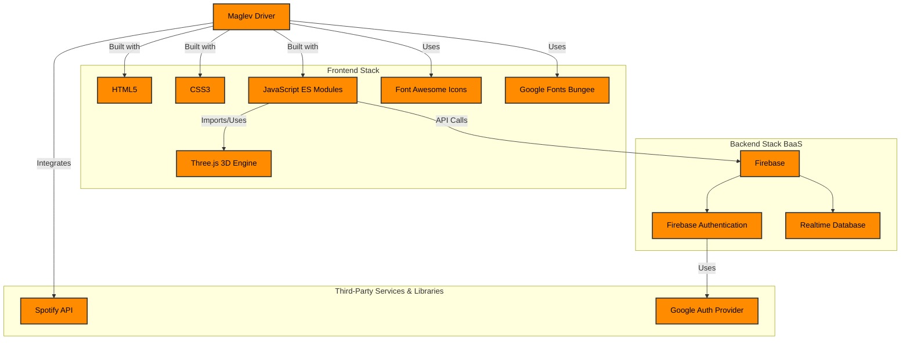

# **Maglev Driver**

**Dodge, Drive, and Survive to Your Own Soundtrack.**

**Maglev Driver** is a fast-paced endless driving game built with three.js. The goal is simple: pilot your maglev car through a neon-drenched, night-time city, dodge the obstacles, and survive as long as you can as the speed gets more and more intense, while listening to your favourite Spotify playlist. It's honestly such a stress reliever just cruising down the night road with your favorite playlist on.

## 🚀 **Demo**

[Live Demo >](https://maglev-driver.web.app/)

> **Note:** API keys and database credentials have been omitted from the codebase because of security reasons.

---

## ✨ Key Features

-   **Spotify Radio**: Link your own Spotify playlist and blast your favorite tracks while you drive.

-   **Fast, 3D Endless Driving**: An immersive, high-speed experience powered by Three.js.

-   **Cross-Platform**: Playable on desktop, mobile, and tablets.

-   **Cloud Saves**: Log in with Google to save your high scores and access them on any device.

-   **Difficulty Modes**: Choose from Easy, Medium, or the absolutely brutal Hard mode.

> **Note:** The Spotify Radio feature is currently supported on desktop browsers (Chrome, Firefox, Edge). Unfortunately, it won’t work on mobile devices or Safari due to Spotify’s API restrictions. Users with a free Spotify account will not be able to play full songs.

---

## 🛠️ Technology Stack

**Frontend:** HTML5, CSS3, JavaScript (ES Modules)

**3D Engine:** Three.js

**Backend & Database:** Firebase (Realtime Database)

**Authentication:** Firebase Google Authentication

**Services:** Spotify API, Google Fonts, Font Awesome

---

## 🚀 Getting Started

### Requirements:
- A modern web browser with JavaScript enabled.
- Stable internet connection for loading media and syncing data.

### Steps:
1. Visit the link.
2. Log in with your Google account to save progress.
3. Select a difficulty and start driving!

---

## 🤝 **Contributing**  

Contributions are always welcome! Please follow these steps:

1. Fork the repository.  
2. Create a new branch (`git checkout -b feature/your-feature`).  
3. Commit your changes (`git commit -m 'Add your message'`).  
4. Push to the branch (`git push origin feature/your-feature`).  
5. Open a pull request.  

---

## 🛡️ License

This project is shared publicly for learning and inspiration purposes only.

❌ You may **NOT** copy, reuse, redistribute, or modify this code.  
✅ You may view and learn from the code.

Copyright © | All rights reserved

---

Built with ❤️ to bring a fast-paced, music-driven driving experience to the web!